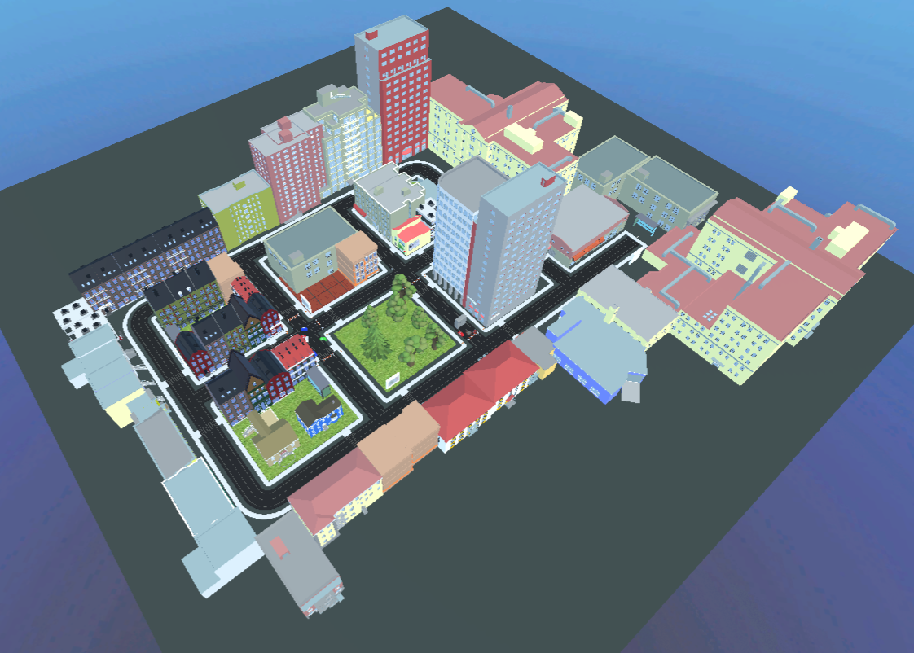

# Wayfinding Map Placement in Urban VR Environments

A VR experiment prototype investigating how the **placement of wayfinding maps** influences navigation performance in an urban travel scenario.  
Developed as part of an interview research task.

  
  
  

**Creator:** Renate Zhang

---

## Research Overview

### Motivation

Wayfinding maps are among the most common tools to help travellers navigate unfamiliar cities without relying on internet access. However, their placement is often arbitrary. With no certainty of where the next map will appear, travellers must rely on short-term memory to hold and execute their planned route.

### Research Question

> *How does the placement of wayfinding maps influence a user's ability to navigate to a goal in an unfamiliar urban environment?*

Specific sub-questions include:
- Where should wayfinding maps be placed to most effectively support navigation?
- What is the minimum number of maps needed for successful navigation?

---

## Study Environment

The virtual environment is inspired by real European city structures and features four distinct districts:

- **Historic Old Town** — dense, irregular street layout
- **Modern Business District** — high-rise buildings, wider streets
- **Industrial Area** — low, plain architecture with few landmarks
- **Residential Areas** — surrounding the above districts

Street names and building signage are deliberately reduced to reflect realistic conditions where such information is not prominently displayed. The current prototype places wayfinding maps at prominent landmarks: the park, the square in front of the bank, near the old town, and at the starting point.

Throughout the environment, **unexpected barricades** force participants to adapt their planned route, simulating realistic disruptions to navigation.

### Study Scenario

Participants begin at a **bus stop in the industrial district**, which simulates arriving at the wrong stop, and must navigate to the **university building**. The fastest route requires two right turns, but barricades redirect participants and test their ability to re-plan.

This scenario is designed to mimic real-world travel for users with limited access to digital navigation tools, such as elderly travellers.

---

## Experimental Design

### Conditions (Prototype shows Condition A)

| Condition | Map Placement |
|-----------|--------------|
| **A** *(implemented)* | At prominent landmarks (park, plaza, old town, start) |
| B *(planned)* | Starting point only |
| C *(planned)* | Every major junction |

The prototype demonstrates a single condition. Future iterations can extend to additional placement strategies and alternative wayfinding systems (e.g. arrows, audio cues, digital kiosks).

---

## Data Collection *(Planned)*

During the study, the following data would be tracked per participant:

- **Position** over time (path reconstruction)
- **Head orientation** (gaze direction at decision points)
- **Time spent** at each wayfinding map (proxy for decision difficulty)

Post-session questionnaires would include:
- **SUS** (System Usability Scale)
- **NASA-TLX** (perceived workload)
- Open-ended questions on navigation reasoning and strategy

---

## Getting Started

### Prerequisites

- Unity 2022 or later
- XR plugin (OpenXR or XR Interaction Toolkit)
- PC with mouse/keyboard (VR headset not yet tested)

Or: run the included **executable** directly (Windows).

### Running the Prototype

**Executable**
1. Extract the build folder.
2. Run `wayfinding_prototype.exe`.

### Controls

| Action | Input |
|--------|-------|
| Walk  | WASD  |
| Look around | Right mouse key or arrow keys |

---

## Technical Details

- **Engine:** Unity (XR Interaction Toolkit)
- **XR Setup:** XR Origin with Hands Rig, XR Interaction Simulator for desktop testing
- **Scene Structure:** Environment, Roads, Plaza, Buildings, Park, Street Signs, Wayfinding Map, Barricades
- **Tracked Objects:** XR Origin (Hands), Camera Offset, Locomotion, Hands Smoothing Post Processor

### File Structure

- **Assets/Scenes/** — Main scene (`SampleScene.unity`)
- **Assets/Environment/** — City district prefabs and props
- **Assets/UI/** — Wayfinding map textures and overlays
